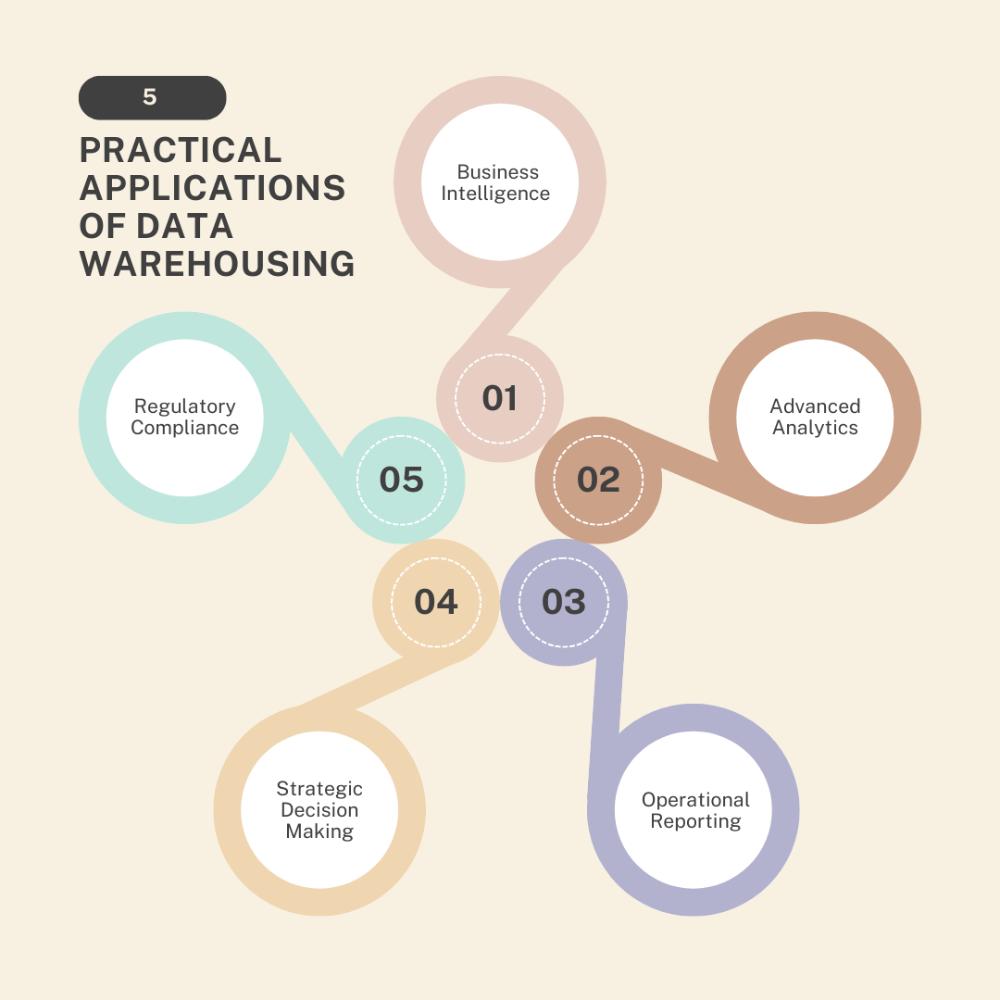
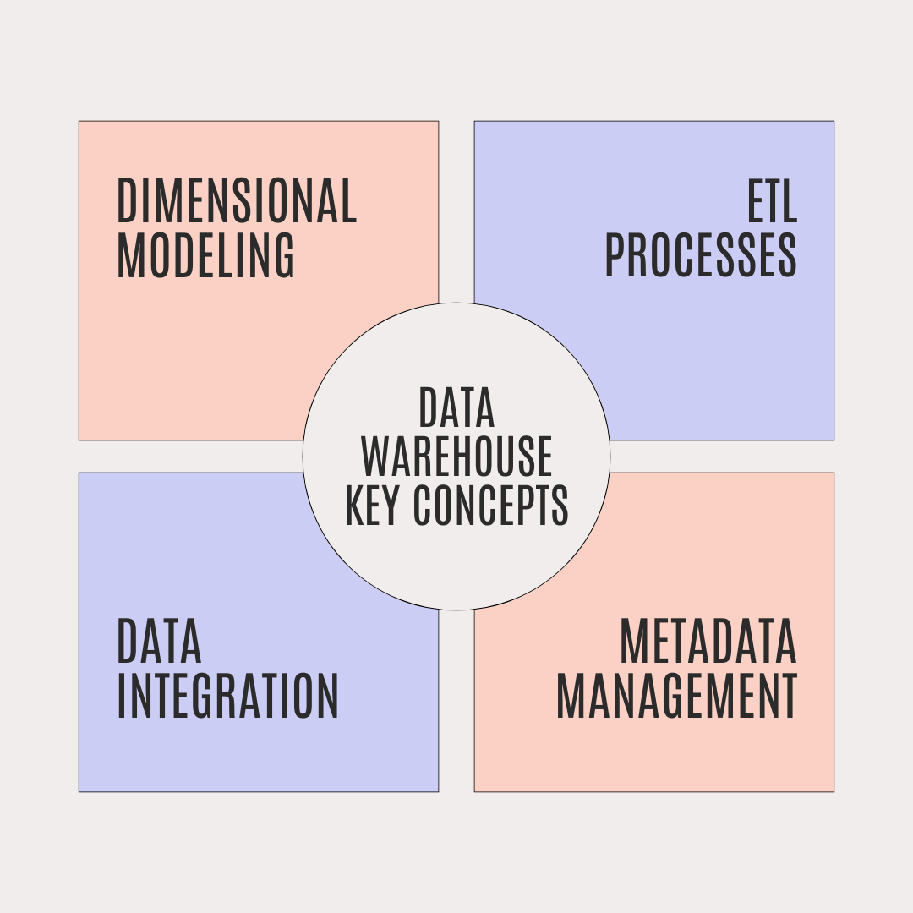
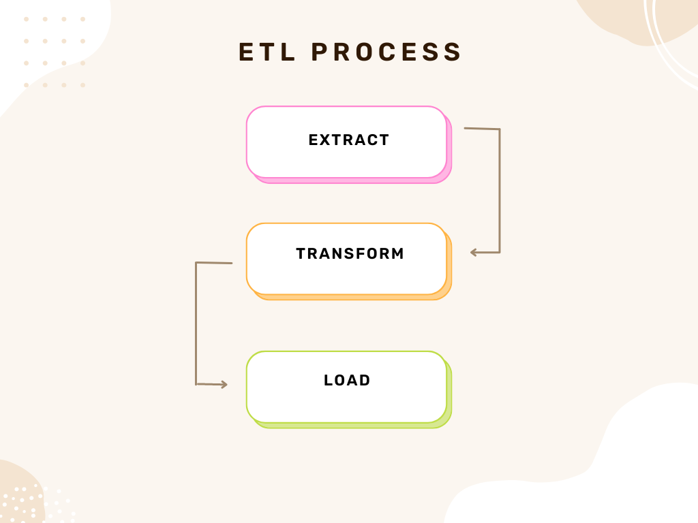

# Data_Warehouses

# Introduction to Data Warehouse

Data Warehousing is a crucial component of modern data management and analytics, serving as a centralized repository for integrating and analyzing data from disparate sources. This README provides an overview of its fundamental concepts, practical applications, and its role in empowering organizations in today's digital era.

## Fundamental Concepts of Data Warehousing

1. **Definition and Purpose**: A data warehouse integrates data from various sources into a unified repository optimized for analysis and reporting. It provides a reliable source of data to support decision-making processes.

2. **Data Integration**: Data warehouses gather data from transactional systems, CRM databases, spreadsheets, etc., ensuring all relevant data is available for analysis in one location.

3. **Schema Design**: Unlike transactional databases, data warehouses use schemas like star or snowflake schemas to optimize data for querying and analysis, distinguishing between facts (numeric data) and dimensions (contextual data).

4. **ETL Processes**: Extract, Transform, Load processes are essential for populating data warehouses. They involve extracting data from source systems, transforming it to fit the warehouse schema, and loading it for analysis.

5. **Data Quality and Consistency**: Maintaining data quality through processes such as cleansing, validation, and normalization is critical for ensuring consistency and reliability in data warehouses.

## Practical Applications of Data Warehousing

1. **Business Intelligence (BI)**: Data warehouses serve as the foundation for BI tools, enabling complex queries, report generation, and data visualization for informed decision-making.

2. **Advanced Analytics**: Supporting techniques like predictive analytics and data mining, data warehouses uncover insights that drive innovation and efficiency within organizations.

3. **Operational Reporting**: Regular reports, dashboards, and KPI monitoring rely on data warehouses to provide up-to-date and consistent information across departments.

4. **Strategic Decision Making**: Executives use data warehouses to gain a comprehensive view of business performance, customer behavior, and market trends, aiding in strategic planning and initiatives.

5. **Regulatory Compliance**: Industries with regulatory requirements rely on data warehouses to ensure data integrity and traceability, supporting compliance efforts.

## Empowering Organizations in the Data-Driven Era

1. **Competitive Advantage**: Well-designed data warehouses enable organizations to respond swiftly to market changes, identify opportunities, and optimize processes, gaining a competitive edge.

2. **Scalability and Flexibility**: Modern data warehouses handle large data volumes and diverse types, scalable to meet growing business needs and adaptable to new data sources and analytics tools.

3. **Cloud-Based Data Warehousing**: Cloud platforms offer scalable, cost-effective solutions, reducing infrastructure costs and enabling rapid deployment and global accessibility.

4. **Real-Time Analytics**: Advancements allow real-time data warehousing and analytics, facilitating decisions based on current information.

5. **Integration with Big Data**: Integration with big data technologies enhances insights by analyzing structured and unstructured data together.

Data Warehousing goes beyond data storage it organizes, integrates, and analyzes data to extract actionable insights. In today's data-rich environment, a well-implemented data warehouse is essential for transforming raw data into valuable information that drives strategic decisions and business success.

# Data Warehouse Key Concepts

Data Warehousing is built upon several foundational concepts that are essential for successful implementations. These concepts enable organizations to consolidate disparate data sources, support complex analytics, and facilitate informed decision-making at scale. This README explores each of these key concepts in detail.

## 1. Dimensional Modeling

**Definition:** Dimensional modeling structures data in a data warehouse to optimize querying and analytics.

**Key Aspects:**
- **Facts and Dimensions:** 
  - **Facts:** Numeric data representing business metrics (e.g., sales amount).
  - **Dimensions:** Descriptive attributes related to facts (e.g., product, time, location).

- **Star Schema:** Central fact table surrounded by dimension tables, resembling a star pattern.
  
- **Snowflake Schema:** Normalized dimension tables, reducing redundancy but increasing complexity.

**Benefits:**
- Simplifies querying and reporting.
- Improves query performance.
- Facilitates intuitive data exploration.

## 2. ETL Processes (Extract, Transform, Load)

**Definition:** ETL processes populate the data warehouse with data from various source systems.

**Key Aspects:**
- **Extract:** Retrieve data from source systems.
- **Transform:** Clean, filter, aggregate, and structure data.
- **Load:** Insert transformed data into the warehouse.

**Tools and Techniques:**
- ETL tools automate processes like scheduling and error handling.
- ELT processes integrate transformations within the database engine.

**Benefits:**
- Integrates heterogeneous data sources.
- Enables historical analysis.
- Supports incremental updates.

## 3. Data Integration

**Definition:** Data integration combines data from different sources into a unified view in the data warehouse.

**Key Aspects:**
- **Data Consolidation:** Integrating data from CRM, ERP, sales systems, etc.
- **Data Cleansing:** Removing inconsistencies, errors, and duplicates.
- **Data Transformation:** Standardizing data formats and structures.

**Techniques:**
- Batch processing and real-time integration.

**Benefits:**
- Provides a single source of truth.
- Reduces data silos.
- Supports faster decision-making.

## 4. Metadata Management

**Definition:** Metadata management manages data about data within the data warehouse environment.

**Key Aspects:**
- **Types of Metadata:** Technical, business, and operational metadata.
- **Metadata Repository:** Centralized storage for metadata.

**Benefits:**
- Enhances data governance.
- Improves data discovery.
- Facilitates impact analysis.

## How These Concepts Enable Organizations

- **Consolidating Disparate Data Sources:** Creates a unified view of business operations.
  
- **Supporting Complex Analytics:** Simplifies complex queries for deeper insights.
  
- **Facilitating Informed Decision-Making:** Provides reliable data for decision-makers.
  
- **Scalability and Flexibility:** Adapts to evolving business needs and new data sources.

These foundational principles of dimensional modeling, ETL processes, data integration, and metadata management are crucial for organizations seeking to harness the full potential of their data. By implementing these concepts effectively, businesses can consolidate data sources, support advanced analytics, and empower decision-makers with timely and accurate insights, thereby gaining a competitive edge in today's data-driven landscape.

# Importance of Data Warehouse

Data Warehousing plays a crucial role in modern enterprises by serving as a centralized repository for integrated data, enabling organizations to achieve a unified view of their operations and harness the full potential of their data assets. This README explores how a well-designed Data Warehouse supports various aspects of business operations and strategic decision-making.

## Central Repository for Integrated Data

### Integration of Disparate Data Sources:
- **Data Consolidation:** Data Warehouses integrate data from CRM, ERP, sales, and marketing platforms, eliminating data silos and providing a single source of truth for reporting and analysis.
- **Data Cleansing and Standardization:** Prior to loading, data undergoes cleansing to remove errors, duplicates, and inconsistencies. Standardization ensures uniformity across different data sources, enhancing data quality and reliability.

## Facilitating Business Intelligence (BI)

### Enabling Complex Analytics:
- **Advanced Analytics:** Data Warehouses support complex analytics such as trend analysis, predictive modeling, and segmentation. Dimensional models (e.g., star schema) facilitate efficient querying and reporting.
- **Real-Time Analytics:** Modern Data Warehouses offer capabilities for real-time data ingestion and analytics, providing up-to-date insights for timely decision-making.

## Supporting Strategic Decision-Making

### Empowering Decision-Makers:
- **Access to Timely and Accurate Information:** Data Warehouses provide decision-makers with timely access to consolidated and reliable data, enabling informed decisions based on comprehensive business performance insights.
- **Scenario Analysis and Forecasting:** Historical data stored in Data Warehouses supports scenario analysis and forecasting, aiding strategic planning and future-proofing initiatives.

## Enhancing Operational Efficiency

### Streamlining Business Processes:
- **Operational Reporting:** Regular operational reports and dashboards derived from Data Warehouses offer insights into key metrics and KPIs, facilitating performance monitoring and improvement.
- **Automated ETL Processes:** ETL processes automate data extraction, transformation, and loading into the Data Warehouse, ensuring data consistency and accuracy while reducing manual effort.

## Driving Innovation and Competitive Advantage

### Harnessing Data Assets:
- **Data-Driven Insights:** Data Warehouses enable businesses to uncover hidden patterns, correlations, and insights within their data, fostering innovation in product development, marketing strategies, and operational efficiencies.
- **Personalized Customer Experiences:** Analysis of customer data stored in Data Warehouses allows organizations to personalize marketing campaigns, improve customer service, and enhance overall customer satisfaction.

Data Warehousing serves as a cornerstone of modern enterprise data management strategies. By providing a unified view of integrated data, facilitating advanced analytics and BI, supporting strategic decision-making, and enhancing operational efficiency, Data Warehouses empower organizations to leverage their data assets effectively.

# Data Lake Vs Data Warehouses

Data Lakes and Data Warehouses are pivotal components of modern data architectures, each serving distinct purposes in managing and analyzing large volumes of data. This README compares and contrasts these two concepts in terms of their roles, architectures, usage scenarios, advantages, challenges, and strategic integration opportunities for organizations.

## Data Lakes

### Role and Purpose:
Data Lakes serve as repositories for raw, unstructured, and semi-structured data in its native format. They facilitate exploratory analysis, data discovery, and advanced analytics including machine learning experiments without the need for upfront data structuring.

### Architecture:
- **Storage:** Typically built on scalable distributed storage systems like Hadoop Distributed File System (HDFS), AWS S3, or Azure Data Lake Storage.
- **Data Ingestion:** Supports batch and real time data ingestion from diverse sources with minimal transformation.
- **Schema on Read:** Data is stored as-is and schema applied at the time of analysis.
- **Tools and Technologies:** Utilizes frameworks like Apache Spark, Apache Hadoop, and various big data processing tools.

### Usage Scenarios:
- **Exploratory Data Analysis:** Ideal for data exploration and hypothesis testing due to its flexibility with raw data.
- **Machine Learning:** Provides rich data sets for training machine learning models.
- **Archival and Compliance:** Cost-effective solution for long-term data retention and regulatory compliance.

### Advantages:
- **Flexibility:** Stores any type of data without predefined schemas.
- **Scalability:** Easily scales to accommodate large volumes of data.
- **Cost Efficiency:** Generally lower storage costs compared to structured data solutions.

### Challenges:
- **Data Quality:** Maintaining data quality and consistency can be challenging without proper governance.
- **Complexity:** Managing diverse data sources and tools can lead to complexity in governance and maintenance.
- **Security:** Requires robust security measures due to the variety and volume of data stored.

## Data Warehouses

### Role and Purpose:
Data Warehouses are optimized for storing and analyzing structured data from transactional systems and other sources. They support business intelligence (BI), reporting, and decision-making processes by providing a structured view of data.

### Architecture:
- **Storage:** Uses relational or columnar databases optimized for structured data storage.
- **Data Modeling:** Schema on write approach where data is structured and optimized for querying and analysis.
- **ETL Processes:** Data undergoes Extract, Transform, Load (ETL) processes to ensure consistency and reliability.
- **Tools and Technologies:** Relies on SQL-based querying, OLAP for complex analysis, and integration tools.

### Usage Scenarios:
- **Business Intelligence:** Supports reporting, dashboards, and visualizations for business users.
- **Operational Reporting:** Provides consolidated views of operational data for day-to-day decision-making.
- **Regulatory Compliance:** Ensures data governance and compliance with structured data.

### Advantages:
- **Performance:** Designed for fast querying and analysis of structured data.
- **Data Consistency:** Maintains high-quality, consistent data through structured schemas and governance.
- **Security:** Offers robust security features and access controls for sensitive business data.

### Challenges:
- **Rigid Schema:** Less flexible for accommodating new types of data compared to Data Lakes.
- **Scalability:** Scaling can be challenging for very large datasets compared to distributed storage solutions.
- **Cost:** Generally higher costs for storage and processing compared to Data Lakes.

## Strategic Integration and Leveraging Both

Organizations can maximize their analytical capabilities by strategically integrating Data Lakes and Data Warehouses:
- **Complementary Roles:** Use Data Lakes for storing raw data and exploratory analysis, while Data Warehouses handle structured data and business reporting.
- **Data Pipeline:** Establish a robust data pipeline where raw data from Data Lakes is curated, refined, and moved to Data Warehouses for structured analysis.
- **Analytics Spectrum:** Support a full range of analytics needs from exploratory data science to operational BI by leveraging the strengths of each architecture.
- **Governance and Security:** Implement comprehensive governance practices across both architectures to ensure data quality, security, and compliance.

While Data Lakes excel in handling raw, unstructured data for exploratory analysis and machine learning, Data Warehouses are optimized for structured data and business intelligence. By strategically integrating both architectures, organizations can effectively drive data-driven decision-making and maximize their analytical capabilities across all levels of the business.

# Data Mart Vs. Data Warehouse

Data Marts and Data Warehouses are essential components of an organization's data management and analytics strategy, each serving distinct purposes and catering to different needs within the organization. This README explores the differences between Data Marts and Data Warehouses, their roles, advantages, and scenarios where each approach is most beneficial.

## Data Warehouses

### Role and Purpose
Data Warehouses serve as centralized repositories that integrate data from various sources across an organization. They are designed to support strategic decision-making by providing a unified view of structured data from different departments or systems.

### Characteristics
- **Scope:** Cover comprehensive data sets across the organization.
- **Data Integration:** Data undergoes ETL processes to ensure consistency and quality.
- **Schema Design:** Utilizes star schema or snowflake schema optimized for analytical queries.
- **Usage:** Supports enterprise-wide reporting, business intelligence, and complex analytics.

### Advantages
- **Comprehensive View:** Provides a holistic view of organizational data, enabling cross-functional analysis and strategic insights.
- **Consistency:** Ensures data consistency and accuracy through centralized governance and control.
- **Scalability:** Can scale to accommodate large volumes of data and diverse analytical needs.

### Scenarios
- **Strategic Decision-Making:** Useful for executives and senior management to gain insights into overall business performance.
- **Cross-Functional Analysis:** Enables analysis that spans multiple departments or business units.
- **Regulatory Compliance:** Ensures compliance with data governance and regulatory requirements.

### Example
A global retailer uses a Data Warehouse to consolidate sales, inventory, and customer data from various regions and systems. This allows executives to analyze sales trends, optimize inventory management, and understand customer behavior across markets.

## Data Marts

### Role and Purpose
Data Marts are subsets of Data Warehouses designed to serve the specific needs of individual departments, business units, or user groups within an organization. They contain focused data sets relevant to particular functions or departments.

### Characteristics
- **Scope:** Focus on specific subject areas (e.g., sales, marketing, finance).
- **Data Subset:** Contains a subset of data from the Data Warehouse, tailored to local requirements.
- **Aggregation:** Data may be aggregated or summarized to meet specific reporting needs.
- **Usage:** Supports localized decision-making, operational reporting, and departmental analytics.

### Advantages
- **Focused Insights:** Provides targeted insights relevant to the specific needs of departments or business units.
- **Performance:** Typically offers faster query performance compared to querying a large Data Warehouse.
- **Flexibility:** Easier to customize and modify schema and data structures to meet local requirements.

### Scenarios
- **Departmental Analysis:** Useful for departments like sales, marketing, or finance to analyze performance metrics specific to their functions.
- **Operational Reporting:** Supports day-to-day operational reporting and monitoring.
- **Quick Deployment:** Can be deployed faster than a full scale Data Warehouse for immediate business needs.

### Example
In a healthcare organization, the marketing department uses a Data Mart within the Data Warehouse to analyze patient demographics, referral sources, and campaign effectiveness. This allows them to tailor marketing strategies and optimize outreach efforts based on localized insights.

## Practical Considerations

- **Integration with Data Warehouse:** Data Marts often extract data from the Data Warehouse through predefined ETL processes, ensuring consistency and alignment with enterprise-wide data governance.
- **Scalability and Maintenance:** While Data Marts are easier to deploy and maintain, organizations need to ensure they align with the overall Data Warehouse architecture to avoid duplication and inconsistency.
- **User Access and Security:** Granular access control is crucial to ensure that each department or user group can access only the data relevant to their responsibilities and roles.

## Strategic Integration

To optimize data accessibility, analysis, and business intelligence:
- **Hybrid Approach:** Organizations often employ a hybrid approach, where a centralized Data Warehouse provides a unified view for strategic decision-making, while Data Marts cater to specific operational or departmental needs.
- **Governance and Data Quality:** Implementing robust governance frameworks ensures data consistency, quality, and security across both Data Warehouses and Data Marts.
- **User Empowerment:** Empowering departments with tailored Data Marts enables faster decision-making and agility in responding to local business challenges.

# ETL Process

The ETL (Extract, Transform, Load) process is a fundamental component of data integration and warehousing, essential for preparing data for analysis and decision-making. This README explores each stage of the ETL process in detail, discussing their importance, challenges, best practices, and real-world examples.

## 1. Extract

### Purpose
The extraction phase involves retrieving data from various sources such as databases, files, applications, APIs, and more. This stage ensures that relevant data is collected and made available for further processing.

### Key Considerations
- **Source Systems:** Data can originate from transactional systems, operational databases (OLTP), flat files, cloud services, or IoT devices.
- **Data Volume:** Efficiently handling large volumes of data requires selecting appropriate extraction methods (full, incremental, or differential).
- **Data Consistency:** Ensuring consistency during extraction to prevent discrepancies between source and target systems.

### Challenges
- **Complexity of Sources:** Dealing with diverse data formats, schema variations, and limitations of APIs.
- **Data Latency:** Ensuring timely extraction to meet operational and analytical needs.

### Best Practices
- **Data Profiling:** Understand source data characteristics (structure, quality, volume) before extraction.
- **Incremental Loading:** Implement techniques like change data capture (CDC) to extract only updated or new data.
- **Data Validation:** Verify data integrity during extraction to identify and address anomalies early.

### Example
A retail company extracts sales data from multiple regional databases and third party POS systems daily to update its Data Warehouse for sales analysis and inventory management.

## 2. Transform

### Purpose
Transformation involves cleaning, structuring, and enriching extracted data to ensure it meets quality, formatting, and business requirements. This stage prepares data for integration into the target system (e.g., Data Warehouse).

### Key Considerations
- **Data Cleaning:** Removing duplicates, correcting errors, handling missing values, and standardizing formats.
- **Data Integration:** Combining data from different sources while maintaining consistency.
- **Data Enrichment:** Enhancing data with additional attributes, calculations, or aggregations.

### Challenges
- **Data Quality:** Ensuring accuracy, completeness, and consistency of transformed data.
- **Performance:** Optimizing transformation processes for efficient handling of large datasets.
- **Complex Business Rules:** Implementing and validating business logic during transformation.

### Best Practices
- **Standardization:** Apply consistent formats, units, and conventions across data elements.
- **Data Validation:** Use validation rules and checks to maintain data quality.
- **Automated Transformation:** Implement automation to streamline repetitive tasks.

### Example
An insurance company transforms claims data by merging information from policy databases, adjusting for currency differences, and calculating claim amounts for loading into its Data Warehouse for claims analysis and fraud detection.

## 3. Load

### Purpose
Loading involves inserting transformed data into the target Data Warehouse or data repository. This phase ensures data is stored in a structured format optimized for querying and analysis.

### Key Considerations
- **Loading Strategies:** Choose between bulk load, incremental load, or real time streaming based on data volume and freshness requirements.
- **Data Integrity:** Ensure consistency and referential integrity during insertion into the warehouse.
- **Performance:** Optimize loading processes to minimize downtime and maximize efficiency.

### Challenges
- **Concurrency:** Handling multiple data streams and maintaining data consistency during concurrent loads.
- **Data Volume:** Managing large datasets and meeting service level agreements (SLAs).
- **Error Handling:** Implement mechanisms to recover from load failures and ensure data integrity.

### Best Practices
- **Parallel Processing:** Use parallel loading techniques to enhance throughput and reduce load times.
- **Data Validation:** Validate data post-loading to confirm accuracy and completeness.
- **Monitoring and Logging:** Implement monitoring tools to track load progress and identify performance bottlenecks.

### Example
A healthcare provider loads patient demographic and medical records data nightly into a centralized Data Warehouse using bulk loading to support analytics for patient care management and medical research.

## Importance of ETL for Data Accuracy and Usability

- **Data Accuracy:** ETL ensures data is cleansed, standardized, and validated, minimizing errors that could affect analysis and decision-making.
- **Data Consistency:** Integrating data from multiple sources ensures consistency in formats and structures across the warehouse.
- **Usability:** Well-structured data facilitates efficient querying, reporting, and analytics, empowering stakeholders with actionable insights.

## Challenges and Best Practices

- **Challenges:** Complexity of data sources, maintaining data quality throughout ETL processes, managing data volumes, and ensuring timely availability.
- **Best Practices:** Use automation, standardized processes, thorough data profiling, continuous monitoring, and adherence to data governance principles to optimize ETL efficiency.

The ETL process is crucial for data integration and warehousing, ensuring extracted data is transformed, cleansed, and loaded into a centralized repository for analysis. Each stage—extracting data from sources, transforming it to meet quality requirements, and loading it into the target system—plays a vital role in ensuring data accuracy, consistency, and usability for decision-making. By implementing best practices and leveraging appropriate technologies, organizations can effectively manage ETL processes to derive valuable insights and maintain competitive advantage in their industries.

Data Marts and Data Warehouses play complementary roles in data management and analytics. While Data Warehouses provide a comprehensive view across the organization for strategic decision-making, Data Marts offer focused insights tailored to specific departments or business units, enhancing operational efficiency and agility in decision-making processes. By strategically integrating both approaches, organizations can leverage their data assets effectively to drive business growth and competitive advantage.

# Traditional Data Warehouse Options

This README explores the characteristics, benefits, challenges, and considerations of traditional on-premises data warehouses versus hosted or cloud-based data warehouses, aiding organizations in making informed decisions for their data management and analytics strategies.

## Traditional On-Premises Data Warehouses

### Architecture
On-premises data warehouses are typically located within an organization's own data center. Key components include:
- **ETL Processes:** Extract, Transform, and Load processes to integrate data from various sources.
- **Data Storage:** Structured storage optimized for query performance.
- **Query and Analysis Tools:** Tools for querying and analyzing structured data.
- **Backup and Recovery:** Systems for data backup and disaster recovery.

### Benefits
- **Control:** Full control over hardware, software, and data security.
- **Security:** Data stored locally potentially reduces exposure to external threats.
- **Performance:** Direct access to data results in faster query response times.

### Challenges
- **Scalability:** Scaling hardware resources can be costly and time-consuming.
- **Upfront Costs:** High initial investment in hardware, software, and infrastructure.
- **Maintenance:** Ongoing maintenance and updates required by IT staff.
- **Flexibility:** Limited flexibility for handling sudden increases in data volume or computing needs.

## Hosted or Cloud-Based Data Warehouses

### Architecture
Cloud-based data warehouses are hosted and managed by third-party providers such as AWS Redshift, Google BigQuery, or Azure Synapse Analytics. Components include:
- **Virtualized Storage:** Provisioned virtually and scaled automatically.
- **Managed Services:** Automated backups, updates, and maintenance.
- **Scalable Compute:** Resources scaled based on demand.
- **Integration with Cloud Ecosystem:** Ingestion, analytics, and visualization with other cloud services.

### Benefits
- **Scalability:** Easily scale storage and compute resources as needed.
- **Flexibility:** Pay-as-you-go pricing and ability to adopt new features quickly.
- **Cost Efficiency:** Reduced upfront costs with operational expenses spread over time.
- **Accessibility:** Data accessible from anywhere with internet connectivity.

### Challenges
- **Data Security:** Concerns about data residency, compliance, and security in the cloud.
- **Dependency on Internet:** Operations reliant on stable internet connectivity.
- **Vendor Lock-in:** Potential dependency on a single cloud provider.
- **Performance:** Impact of network latency and bandwidth on performance.

## Factors Influencing Decisions

### On-Premises Considerations
- **Data Sensitivity:** Industries with strict data regulations may prefer on-premises solutions.
- **Legacy Systems:** Organizations heavily invested in on-premises infrastructure may continue using it.
- **Predictable Workloads:** Stable and predictable workloads justify upfront investment.

### Cloud-Based Considerations
- **Scalability Needs:** Businesses with fluctuating demand benefit from cloud scalability.
- **Cost Considerations:** Startups find cloud options more affordable due to lower upfront costs.
- **Innovation:** Access to cutting-edge technologies and frequent updates.
- **Global Accessibility:** Organizations with global operations benefit from data accessibility across regions.

## Technological Advancements and Future Trends

- **Serverless Data Warehousing:** Serverless architectures for efficient resource utilization.
- **AI and Machine Learning Integration:** Enhanced analytics through AI-driven insights.
- **Hybrid Data Warehousing:** Integration of on-premises and cloud solutions for cost and performance optimization.
- **Data Mesh Architectures:** Distributed data architecture focusing on domain-driven design.

Traditional on premises data warehouses offer control and security but may lack scalability and cost-efficiency compared to cloud-based solutions. Cloud-based data warehouses provide scalability, flexibility, and integration with modern technologies but raise concerns about security and vendor lock-in. Organizations should evaluate these factors based on their specific needs, regulatory requirements, and long-term strategic goals to choose the optimal data warehousing solution. The future promises continued advancements in cloud technologies and hybrid approaches to meet evolving business needs for data analytics and business intelligence.

# Dimensional Modeling

Dimensional Modeling is a design technique used in data warehousing to organize and structure data for efficient query and analysis. The principles, benefits, schema designs (star schema and snowflake schema), real-world examples, and advantages of Dimensional Modeling in enhancing business intelligence and data-driven decision-making.

## Star Schema

### Principles
- **Structure:** Consists of a central fact table surrounded by dimension tables.
- **Centralized Fact Table:** Fact table at the center captures business processes/events.
- **Denormalized Design:** Dimension tables are denormalized for simplicity and performance.
- **Primary Keys:** Each dimension table has a primary key referenced by foreign keys in the fact table.

### Advantages
- **Query Performance:** Optimized for fast query responses with minimal joins.
- **Simplicity:** Easy navigation and understanding for end-users.
- **Flexibility:** Supports ad-hoc querying and reporting.
- **Scalability:** Efficiently handles large data volumes.

### Example
In a retail scenario, a star schema might include a fact table for sales transactions, with dimensions like time, product, store, and customer. This structure facilitates quick analysis of sales performance across different dimensions.

## Snowflake Schema

### Principles
- **Normalization of Dimensions:** Dimension tables normalized into multiple related tables.
- **Hierarchical Structure:** Tables organized into a hierarchy of normalized tables.
- **Join Complexity:** More joins compared to star schema, impacting query performance.
- **Data Integrity:** Ensures better data integrity and reduces redundancy.

### Advantages
- **Space Efficiency:** Reduces storage space by eliminating redundant data.
- **Maintenance:** Easier maintenance and updates due to normalized structure.
- **Complex Data Relationships:** Suitable for intricate relationships between dimensions.

### Example
In healthcare analytics, a snowflake schema might model patient data with dimensions like demographics, medical history (normalized into sub-tables), treatments, and diagnoses. This allows for detailed analysis of patient outcomes and healthcare trends.

## Advantages of Dimensional Modeling

### Enhanced Query Performance
- **Aggregated Data:** Fact tables store pre-aggregated data for faster queries.
- **Optimized Joins:** Minimal joins simplify query complexity and processing time.

### Simplified Data Navigation
- **Intuitive Structure:** Straightforward schemas enable easy understanding of data relationships.
- **Self-Service BI:** Non-technical users can perform ad-hoc queries and create reports independently.

### Facilitates Intuitive Reporting and Analytics
- **Business Context:** Aligns data with business processes, enhancing meaningful analysis.
- **Drill-Down Capability:** Supports drilling down from summaries to detailed data for deeper insights.

## Real-World Examples

### Case Study: Retail Sales Analysis
- **Scenario:** A retail chain analyzes sales performance using star schema.
- **Schema:** Fact table includes sales transactions; dimensions include product, store, time, and customer.
- **Benefits:** Enables quick analysis of sales trends by category, location, and customer demographics, accelerating decision-making.

### Case Study: Healthcare Analytics
- **Scenario:** Healthcare provider uses snowflake schema for patient data management.
- **Schema:** Fact table records patient encounters; dimensions include demographics, medical history (normalized), treatments, and diagnoses.
- **Benefits:** Supports complex analytics such as treatment outcomes, disease prevalence, and resource allocation.

Dimensional Modeling, through star and snowflake schema designs, is fundamental in structuring data warehouses for efficient querying, intuitive reporting, and insightful analytics. It enhances query performance, simplifies data navigation, and facilitates comprehensive business intelligence across various industries. Real world examples illustrate its effectiveness in supporting decision-making and operational insights, showcasing its adaptability and scalability in handling large data volumes. As organizations prioritize data-driven strategies, Dimensional Modeling remains a cornerstone technique for designing robust and user-friendly data warehouse solutions.

# Dimensional Modeling Vs Traditional Approach

This README compares Dimensional Modeling with the traditional data modeling approach, highlighting their focuses, strengths, weaknesses, suitability for different data analysis scenarios, scalability, flexibility, and practical considerations in real-world applications.

## Dimensional Modeling

### Focus
- **Organizing Data:** Dimensional Modeling organizes data into dimensions (descriptive attributes) and facts (measurable numeric metrics).
- **Schema Designs:** Utilizes star schema (denormalized) or snowflake schema (normalized) to optimize query performance and analytical flexibility.
- **Optimized for Analysis:** Designed to support intuitive querying, reporting, and analytics by aligning data with business processes and user needs.

### Strengths
- **Query Performance:** Optimized for read-heavy operations with minimal joins in star schema.
- **User-Friendly:** Intuitive structure facilitates easy navigation and understanding by end-users.
- **Flexibility:** Supports ad-hoc querying and reporting, suitable for dynamic business environments.

### Weaknesses
- **Redundancy:** May contain some redundant data due to denormalization, impacting storage efficiency.
- **Complex Updates:** Updates to dimensional models can be more complex, potentially affecting data consistency.

### Example
- **Retail Sales Analysis:** Star schema used to analyze sales data by product, store, time, and customer dimensions. Facilitates quick insights into sales performance and customer behavior.

## Traditional Data Modeling

### Focus
- **Data Integrity:** Emphasizes reducing redundancy and ensuring data integrity through normalized relational schemas.
- **Normalization:** Tables are normalized to minimize data redundancy and dependency.
- **Complex Relationships:** Uses foreign keys and joins to manage complex data relationships.

### Strengths
- **Data Integrity:** Ensures high data integrity and consistency through normalization.
- **Storage Efficiency:** Reduces storage redundancy by avoiding denormalization.
- **Complex Data Relationships:** Well-suited for complex data models with intricate relationships.

### Weaknesses
- **Query Performance:** May suffer from slower query performance due to multiple joins required for analysis.
- **Complexity for Users:** More complex for end-users to navigate and understand data relationships.
- **Maintenance Overhead:** Requires more effort for maintenance and updates, especially in large and dynamic datasets.

### Example
- **Financial Transactions:** Normalized schema used to manage financial transactions, ensuring accuracy and compliance with accounting standards. Supports complex reporting and auditing requirements.

## Comparison

### Suitability for Data Analysis
- **Dimensional Modeling:** Ideal for analytical environments where quick and intuitive querying and reporting are critical. Suitable for business intelligence and decision support systems.
- **Traditional Data Modeling:** Best suited for transactional systems where data integrity and normalization are paramount, such as financial systems or operational databases.

### Scalability
- **Dimensional Modeling:** Scales well for analytical workloads and flexible reporting needs, but may require careful design to manage large volumes of data efficiently.
- **Traditional Data Modeling:** Scalability can be challenging due to the complexity of joins and maintenance overhead as datasets grow.

### Flexibility
- **Dimensional Modeling:** Offers flexibility for evolving business requirements and ad-hoc analysis, supporting agile decision-making processes.
- **Traditional Data Modeling:** More rigid in structure, less adaptable to changing business needs without significant redesign.

## Practical Considerations

### Case Study Examples
- **Dimensional Modeling:** A retail chain uses star schema to analyze sales trends across different regions, products, and customer segments. This structure facilitates quick insights into performance metrics and promotional effectiveness.
- **Traditional Data Modeling:** A healthcare provider employs a normalized schema to manage patient records, ensuring accuracy and compliance with healthcare regulations. The system supports complex patient care pathways and clinical research analysis.

Dimensional Modeling and traditional data modeling approaches serve different purposes within the context of Data Warehousing. Dimensional Modeling excels in supporting analytical queries and intuitive reporting by organizing data into easily navigable structures like star schemas or snowflake schemas. In contrast, traditional data modeling prioritizes data integrity and reduces redundancy through normalized relational schemas, making it suitable for transactional systems with complex data relationships.

The choice between these approaches depends on specific organizational needs, data usage patterns, and the complexity of data relationships. Understanding their strengths and weaknesses helps organizations design effective data warehouse solutions that align with their business objectives and support informed decision-making processes.

# Facts and Dimensions in Data Warehousing

In data warehousing, Facts and Dimensions are fundamental concepts used to structure and organize data for effective analysis and reporting.

## Facts

### Definition
- **Measurable Data:** Facts represent core quantitative data analyzed in businesses, such as sales revenue, quantity sold, profit margin, etc.
- **Transactional Source:** Derived from transactional systems or operational databases where business events are recorded.

### Role in Business Analysis
- **Key Performance Indicators (KPIs):** Foundation for calculating KPIs that measure business performance (e.g., total sales revenue).
- **Metrics:** Provide metrics for evaluating performance, identifying trends, and making informed decisions.

### Example
In a retail data warehouse:
- **Sales Amount:** Total sales transactions amount.
- **Units Sold:** Quantity of each product sold.
- **Profit:** Profit margin per sale.

## Dimensions

### Definition
- **Descriptive Context:** Dimensions describe the who, what, where, when, why, and how of business activities.
- **Categorical Attributes:** Typically categorical, providing descriptive information about the facts.
- **Hierarchical Organization:** Often organized hierarchically, supporting drill-down analysis from summaries to detailed insights.

### Role in Business Analysis
- **Data Organization:** Categorizes data into logical groups (e.g., time, geography, products).
- **Analysis Facilitation:** Enables slicing and dicing of facts for deeper insights (e.g., sales revenue by product category).

### Example
In the same retail data warehouse:
- **Time:** Date, month, quarter, year.
- **Product:** Category, subcategory, brand.
- **Customer:** Demographics, loyalty status.

## Relationship between Facts and Dimensions

### Integration in Data Warehousing
- **Schema Design:** Integrated into data warehouse schemas like star schema (fact-centric) or snowflake schema (normalized).
- **Fact-Table Centric:** Star schema surrounds facts with dimension tables for efficient querying.
- **Normalized Hierarchies:** Snowflake schema normalizes dimension hierarchies to improve data integrity.

### Importance of Granularity and Hierarchies
- **Granularity:** Ensures facts capture sufficient detail without being overly aggregated or granular.
- **Hierarchies:** Defined hierarchies enable structured navigation and drill-down capabilities for detailed analysis.

## Real-World Examples

### Case Study: Retail Sales Analysis
- **Facts:** Total sales revenue, units sold, profit margin.
- **Dimensions:** Time (year, quarter, month), Product (category, brand), Customer (demographics).
- **Use Case:** Analyzing sales performance by product category over time, identifying top-selling products by region, and segmenting customer purchasing behavior.

### Case Study: Healthcare Analytics
- **Facts:** Patient encounters, medical procedures performed, healthcare costs.
- **Dimensions:** Patient (demographics, medical history), Provider (specialty, location), Time (admission date, discharge date).
- **Use Case:** Analyzing patient treatment outcomes by procedure type, monitoring healthcare utilization trends by demographics and provider specialty.

Facts and Dimensions are essential components of data warehousing that together provide comprehensive insights into business operations. Facts quantify business activities and drive KPIs, while Dimensions provide descriptive context and organizational structure for meaningful analysis. Choosing appropriate granularity and establishing clear hierarchies within dimensions ensures data accuracy and relevance for decision-making. Effective schema design, such as star or snowflake schemas, optimizes the integration and utilization of Facts and Dimensions, supporting robust analytical capabilities and strategic insights across various industries and use cases.

# Star Schema and Snowflake Schema in Data Warehousing

## Star Schema

### Definition:
- **Structure:** Organizes data into a central fact table surrounded by denormalized dimension tables.
- **Simplicity:** Minimizes joins for query performance and simplifies data retrieval.
- **Design Elements:** Each dimension table directly relates to the fact table via foreign key relationships.

### Advantages:
- **Query Performance:** Faster due to fewer joins and denormalized structure.
- **Simplicity:** Easy to understand, navigate, and use for reporting and analysis.
- **Scalability:** Well-suited for large data volumes and complex queries.

### Disadvantages:
- **Redundancy:** Potential for data redundancy due to denormalization.
- **Limited Flexibility:** Less adaptable for complex relationships and hierarchical data.

### Best Use Cases:
- **Business Intelligence:** Ideal for BI and reporting where performance and simplicity are key.
- **Ad-hoc Queries:** Suitable for environments needing frequent ad-hoc queries and rapid data retrieval.

### Example:
In a retail data warehouse:
- **Fact Table:** Sales transactions.
- **Dimensions:** Product, Time, Store, Customer.
- **Use Case:** Analyzing sales by product category over time across stores.

## Snowflake Schema

### Definition:
- **Structure:** Normalizes dimension tables into multiple related tables, enhancing data integrity.
- **Normalization:** Splits dimension tables into sub-tables forming hierarchical relationships.
- **Complexity:** Involves more joins compared to star schema due to normalized structure.

### Advantages:
- **Data Integrity:** Maintains high data integrity by reducing redundancy.
- **Storage Efficiency:** Decreases storage needs by avoiding denormalization.
- **Scalability:** Ideal for complex data models and evolving data requirements.

### Disadvantages:
- **Query Performance:** Potentially slower due to increased join operations.
- **Complexity:** More challenging to design, understand, and maintain.
- **Flexibility:** Less flexible for ad-hoc querying and reporting compared to star schema.

### Best Use Cases:
- **Transactional Systems:** Suitable for systems emphasizing data integrity and normalization.
- **Complex Data Models:** Ideal for applications needing structured and hierarchical data organization.

### Practical Considerations and Use Cases

**Case Study Examples:**

1. **Star Schema Implementation:**
   - **Industry:** Retail.
   - **Scenario:** Analyzing sales performance using a star schema.
   - **Structure:** Sales transactions (fact table), dimensions include product, time, store, and customer.
   - **Benefits:** Enables rapid analysis of sales trends across various dimensions, supporting strategic decisions.

2. **Snowflake Schema Implementation:**
   - **Industry:** Healthcare.
   - **Scenario:** Managing patient data with a snowflake schema.
   - **Structure:** Patient encounters (fact table), dimensions include patient demographics, medical history (normalized), treatments, and diagnoses.
   - **Benefits:** Ensures data accuracy and supports complex analytics like treatment outcomes and disease prevalence.

Star schema and snowflake schema are vital data modeling techniques in data warehousing, each offering unique strengths for different data environments. Star schema optimizes query performance and simplicity, making it ideal for analytical queries and reporting. In contrast, snowflake schema prioritizes data integrity and efficiency, suitable for complex data relationships and transactional systems. Choosing between these schemas requires assessing factors such as query performance needs, data complexity, scalability, and maintenance requirements. By leveraging these schemas effectively, organizations can enhance their business intelligence capabilities and make informed decisions across diverse industries and applications.

# Comprehensive Data Schema for a Fictional Retail Company

## Business Metrics (Facts)

### Sales Fact Table:
- **sales_id** (Primary Key)
- **product_id** (Foreign Key to Product Dimension)
- **customer_id** (Foreign Key to Customer Dimension)
- **time_id** (Foreign Key to Time Dimension)
- **location_id** (Foreign Key to Location Dimension)
- **sales_amount** (Numeric)
- **quantity_sold** (Numeric)
- **average_order_value** (Numeric)

## Dimensions

1. **Product Dimension:**
   - **product_id** (Primary Key)
   - **product_name**
   - **product_category_id** (Foreign Key to Product Category Dimension)
   - **product_subcategory_id** (Foreign Key to Product Subcategory Dimension)
   - **product_details_id** (Foreign Key to Product Details Dimension)

2. **Customer Dimension:**
   - **customer_id** (Primary Key)
   - **customer_name**
   - **customer_address**
   - **customer_city**
   - **customer_state**
   - **customer_country**

3. **Time Dimension:**
   - **time_id** (Primary Key)
   - **date**
   - **day_of_week**
   - **month**
   - **quarter**
   - **year**

4. **Location Dimension:**
   - **location_id** (Primary Key)
   - **store_id**
   - **store_name**
   - **city**
   - **state**
   - **country**

5. **Product Category Dimension:**
   - **product_category_id** (Primary Key)
   - **category_name**

6. **Product Subcategory Dimension:**
   - **product_subcategory_id** (Primary Key)
   - **subcategory_name**

7. **Product Details Dimension:**
   - **product_details_id** (Primary Key)
   - **unit_price**
   - **weight**
   - **size**

## Star Schema Design

### Description:
- **Central Fact Table:** `Sales`
  - **Dimensions:** `Product`, `Customer`, `Time`, `Location`
  - **Measures:** `sales_amount`, `quantity_sold`, `average_order_value`
- **Denormalized Structure:** Simplifies queries with fewer joins, optimized for fast analytical querying and reporting.

## Snowflake Schema Design

### Description:
- **Central Fact Table:** Same as Star Schema (`Sales`)
- **Normalized Dimensions:**
  - `Product Dimension` normalized into:
    - `Product Category Dimension`
    - `Product Subcategory Dimension`
    - `Product Details Dimension`
  - **Relationships:** Each dimension table linked through foreign keys, enabling structured and hierarchical data analysis.

## Analytical Queries Supported by Each Schema

1. **Sales Trends by Product Category Over Time:**
   - **Star Schema:** Directly query `Sales` fact table joined with `Product` and `Time` dimensions.
   - **Snowflake Schema:** Join `Sales` fact table with `Product Category`, `Product Subcategory`, and `Time` dimensions.

2. **Customer Segmentation Based on Geography:**
   - **Star Schema:** Query `Sales` fact table joined with `Customer` and `Location` dimensions.
   - **Snowflake Schema:** Join `Sales` fact table with `Customer`, `City`, `State`, and `Country` dimensions.

3. **Profitability Analysis Across Different Product Lines:**
   - **Star Schema:** Aggregate sales amount and quantity sold by `Product` dimension attributes.
   - **Snowflake Schema:** Analyze profitability at different levels (category, subcategory, details) using normalized dimensions.

## Trade-offs Between Star Schema and Snowflake Schema

### Star Schema:
- **Advantages:** Simplicity, better query performance with fewer joins, suitable for straightforward data structures and less complex queries.
- **Disadvantages:** Potential redundancy, less flexible for complex hierarchical data analysis.

### Snowflake Schema:
- **Advantages:** Enhanced data integrity, storage efficiency through normalization, supports complex data relationships and hierarchical queries.
- **Disadvantages:** Increased query complexity and potentially slower performance due to more joins, requires meticulous schema design and maintenance effort.

## Scenario-Based Use Cases

- **Star Schema:** Ideal for a retail company focusing on rapid sales analysis across products, customers, time, and locations. Suitable for environments with frequent ad-hoc querying and reporting needs.

- **Snowflake Schema:** Recommended for businesses managing complex product hierarchies or requiring detailed analysis at multiple hierarchical levels (category, subcategory, details). Also beneficial for industries prioritizing data integrity and normalization, such as healthcare or financial services.

Star schema and snowflake schema are pivotal data modeling techniques in data warehousing, each offering distinctive strengths tailored to specific organizational requirements. Choosing between these schemas necessitates evaluating factors like query performance demands, data complexity, scalability requirements, and maintenance feasibility. By leveraging these schemas effectively, organizations can design robust data warehouse architectures that bolster analytical capabilities, foster informed decision-making, and drive business growth.

# Comprehensive Data Architecture for a Multinational E-commerce Platform

## Business Metrics (Facts)

### Sales Fact Table:
- **sales_id** (Primary Key)
- **product_id** (Foreign Key to Product Dimension)
- **customer_id** (Foreign Key to Customer Dimension)
- **time_id** (Foreign Key to Time Dimension)
- **location_id** (Foreign Key to Location Dimension)
- **campaign_id** (Foreign Key to Campaign Dimension)
- **sales_amount** (Numeric)
- **units_sold** (Numeric)
- **discount_amount** (Numeric)
- **net_sales_amount** (Numeric, calculated)

### Other Business Metrics:
- **Customer Acquisition Cost (CAC):** Cost incurred to acquire a new customer.
- **Inventory Turnover:** Measure of how often inventory is sold and replaced over a period.

## Dimensions

1. **Product Dimension:**
   - **product_id** (Primary Key)
   - **product_name**
   - **product_category_id** (Foreign Key to Product Category Dimension)
   - **product_subcategory_id** (Foreign Key to Product Subcategory Dimension)
   - **product_details_id** (Foreign Key to Product Details Dimension)

2. **Customer Dimension:**
   - **customer_id** (Primary Key)
   - **customer_name**
   - **customer_email**
   - **customer_age**
   - **customer_gender**
   - **customer_address**
   - **customer_city**
   - **customer_state**
   - **customer_country**

3. **Time Dimension:**
   - **time_id** (Primary Key)
   - **date**
   - **day_of_week**
   - **month**
   - **quarter**
   - **year**

4. **Location Dimension:**
   - **location_id** (Primary Key)
   - **store_id**
   - **store_name**
   - **city**
   - **state**
   - **country**

5. **Campaign Dimension:**
   - **campaign_id** (Primary Key)
   - **campaign_name**
   - **campaign_type**
   - **start_date**
   - **end_date**
   - **campaign_budget**

6. **Product Category Dimension:**
   - **product_category_id** (Primary Key)
   - **category_name**

7. **Product Subcategory Dimension:**
   - **product_subcategory_id** (Primary Key)
   - **subcategory_name**

8. **Product Details Dimension:**
   - **product_details_id** (Primary Key)
   - **unit_price**
   - **weight**
   - **size**

## Star Schema Design

### Description:
- **Central Fact Table:** `Sales`
  - **Dimensions:** `Product`, `Customer`, `Time`, `Location`, `Campaign`
  - **Measures:** `sales_amount`, `units_sold`, `discount_amount`, `net_sales_amount`
- **Denormalized Structure:** Facilitates efficient querying and reporting on sales performance across multiple dimensions.

## Snowflake Schema Design

### Description:
- **Central Fact Table:** Same as Star Schema (`Sales`)
- **Normalized Product Dimension:**
  - `Product Dimension` is normalized into:
    - `Product Category Dimension`
    - `Product Subcategory Dimension`
    - `Product Details Dimension`
  - **Relationships:** Maintains data integrity and supports detailed analysis of product sales at various hierarchical levels.

## ETL Process

1. **Extract:**
   - Data is extracted from various sources including transactional databases (sales data), marketing platforms (campaign data), and supply chain systems (inventory data).

2. **Transform:**
   - Data undergoes cleansing, standardization, and enrichment to ensure consistency and quality.
   - Example transformations: Date formats normalization, customer demographic enrichment, and product categorization.

3. **Load:**
   - Transformed data is loaded into staging areas where it undergoes further validation and integration.
   - Data is subsequently loaded into the Data Warehouse following ETL best practices to maintain efficiency and reliability.

## Implementation Challenges and Considerations

1. **Scalability:**
   - Ensure the architecture can scale to handle increasing data volumes and user concurrency as the e-commerce platform grows globally.

2. **Data Governance:**
   - Establish robust data governance practices to ensure data quality, consistency, and compliance with regulatory requirements.

3. **Performance Optimization:**
   - Optimize query performance by indexing key fields, partitioning large tables, and implementing caching mechanisms for frequently accessed data.

## Strategic Benefits of the Advanced Data Architecture

- **Real-Time Analytics:** Enables real-time insights into sales performance, customer behavior, and campaign effectiveness.
- **Personalized Marketing Campaigns:** Utilizes customer demographics and campaign data for targeted marketing strategies.
- **Inventory Forecasting:** Analyzes inventory turnover and sales trends to optimize stock levels and minimize stockouts.
- **Customer Segmentation:** Segments customers based on demographics, purchasing behavior, and geographic location for personalized marketing and improved customer retention.

The use of Dimensional Modeling principles, combined with Star Schema and Snowflake Schema designs, offers a robust data architecture for a multinational e-commerce platform. This architecture supports efficient querying, comprehensive analytics, and strategic decision-making across diverse dimensions such as product, customer, time, location, and campaign. Implementing effective ETL processes ensures data consistency and quality from multiple sources to the Data Warehouse, facilitating real-time analytics, personalized marketing, inventory forecasting, and customer segmentation. By addressing scalability, data governance, and performance optimization challenges, the advanced data architecture enhances operational efficiency and customer experience, driving business success in the competitive e-commerce landscape.

# Cloud Data Warehouse

Cloud data warehousing has transformed modern data architecture by harnessing scalable cloud infrastructure to store and analyze vast amounts of data from diverse sources. This approach provides substantial advantages over traditional on-premises solutions, including elasticity, cost-efficiency, and seamless integration with other cloud services and tools.

## Advantages of Cloud Data Warehousing

1. **Elasticity and Scalability:**
   - Cloud data warehouses can dynamically scale resources up or down based on demand, ensuring optimal performance and cost efficiency. This elasticity allows organizations to handle fluctuating workloads without over-provisioning resources.

2. **Cost Efficiency:**
   - Pay-as-you-go pricing models eliminate upfront hardware costs and allow organizations to pay only for the resources they consume. This flexibility optimizes IT spending and supports budget management.

3. **Integration with Cloud Ecosystem:**
   - Cloud data warehouses seamlessly integrate with other cloud services such as machine learning, data lakes, and real-time analytics platforms. This integration facilitates comprehensive data pipelines and enhances collaboration across different teams and technologies.

## Comparison of Popular Cloud Data Warehouse Providers

1. **Amazon Redshift:**
   - **Features:** Columnar storage, massively parallel processing (MPP), and deep integration with AWS ecosystem.
   - **Pricing:** Based on instance types, storage usage, and data transfer.
   - **Performance:** High performance for large-scale data processing and complex queries.
   - **Use Cases:** Data warehousing, analytics, and business intelligence across enterprises.

2. **Google BigQuery:**
   - **Features:** Serverless architecture, automatic scaling, and integration with Google Cloud Platform (GCP) services.
   - **Pricing:** Pay-as-you-go pricing per query processed and storage used.
   - **Performance:** Fast query execution, suitable for ad-hoc querying, real-time analytics, and machine learning.
   - **Use Cases:** Ad-hoc analysis, real-time insights, and machine learning applications.

3. **Snowflake:**
   - **Features:** Multi-cluster shared data architecture, separation of compute and storage, and support for structured and semi-structured data.
   - **Pricing:** Based on compute resources (virtual warehouses), storage usage, and data transfer.
   - **Performance:** Scalable and efficient for diverse workloads including data warehousing, data lakes, and data engineering.
   - **Use Cases:** Data sharing, data integration, and diverse analytics across different business units.

## Real-World Case Studies

1. **Netflix (Snowflake):**
   - **Challenge:** Scale data warehouse to handle massive streaming data and diverse analytics needs.
   - **Solution:** Implemented Snowflake for scalability and performance, supporting real-time analytics for content recommendations and user experience enhancements.

2. **Airbnb (Google BigQuery):**
   - **Challenge:** Analyze large volumes of user data and operational metrics cost-effectively.
   - **Solution:** Adopted Google BigQuery for its serverless architecture, enabling complex data analysis and improving operational efficiency.

3. **Pinterest (Amazon Redshift):**
   - **Challenge:** Consolidate and analyze data from multiple sources for business intelligence and reporting.
   - **Solution:** Deployed Amazon Redshift for its performance and integration with AWS services, enhancing user engagement analysis and content optimization.

Cloud data warehousing empowers organizations to leverage scalable infrastructure, achieve cost efficiencies, and integrate seamlessly with cloud services for advanced analytics and insights. Providers like Amazon Redshift, Google BigQuery, and Snowflake offer tailored solutions for different organizational needs, supporting data-driven decision-making and operational agility. As businesses embrace cloud technology, cloud data warehousing remains pivotal in driving innovation and competitive advantage through robust data strategies.

# Cloud vs On-Premise Data Warehousing Solutions

## Cloud Data Warehousing

### Advantages:

1. **Scalability:**
   - **Cloud:** Offers scalable resources on-demand to adjust to varying workloads and data volumes.
   - **Example:** Netflix uses Amazon Redshift to handle massive data volumes during peak streaming times, scaling resources as needed for optimal performance.

2. **Flexibility:**
   - **Cloud:** Integrates seamlessly with other cloud services like data lakes, machine learning, and real-time analytics platforms.
   - **Example:** Airbnb leverages Google BigQuery for real-time data analysis and personalized user experiences, integrating with other Google Cloud services.

3. **Cost Efficiency:**
   - **Cloud:** Operates on pay-as-you-go models, eliminating upfront hardware costs and enabling cost-effective resource management.
   - **Example:** Pinterest utilizes Amazon Redshift to analyze user engagement efficiently, managing costs through scalable cloud resources.

4. **Rapid Deployment:**
   - **Cloud:** Facilitates rapid deployment and provisioning compared to traditional on-premise setups, accelerating time-to-insight and market responsiveness.
   - **Example:** Spotify employs Snowflake for data-driven decision-making and enhanced user experiences, benefiting from rapid deployment capabilities in the cloud.

### Challenges:

- **Data Governance:** Ensuring compliance and data security across distributed cloud environments can be complex.
- **Latency:** Geographic distribution and network latency may impact real-time data access and application performance.

## On-Premise Data Warehousing

### Advantages:

1. **Control and Security:**
   - **On-Premise:** Provides full control over data security and compliance, critical for industries with stringent regulatory requirements.
   - **Example:** Financial institutions prefer on-premise solutions for managing sensitive financial data securely.

2. **Performance:**
   - **On-Premise:** Offers potentially lower latency and faster data access compared to cloud solutions, ideal for real-time processing needs.
   - **Example:** Healthcare organizations deploy on-premise data warehouses for managing patient data with high security and low latency.

3. **Predictable Costs:**
   - **On-Premise:** Upfront investment in hardware and infrastructure leads to predictable long-term costs.
   - **Example:** Manufacturing firms adopt on-premise solutions for efficient data management without dependence on external services.

### Challenges:

- **Scalability:** Scaling on-premise solutions requires significant upfront investment in hardware and infrastructure.
- **Maintenance:** Higher maintenance costs and IT overheads for managing and updating on-premise hardware and software.

## Considerations for Choosing Between Cloud and On-Premise Solutions

1. **Initial Investment:**
   - **Cloud:** Lower upfront costs with pay-as-you-go pricing.
   - **On-Premise:** Higher initial investment in hardware and infrastructure.

2. **Maintenance Costs:**
   - **Cloud:** Typically lower ongoing maintenance costs due to managed services.
   - **On-Premise:** Higher maintenance costs for hardware, software updates, and IT support.

3. **Scalability:**
   - **Cloud:** Easily scalable with on-demand resources.
   - **On-Premise:** Scalability limited by hardware capacity and upfront investment.

4. **Performance and Latency:**
   - **Cloud:** May have higher latency depending on network and data location.
   - **On-Premise:** Lower latency for sensitive applications with local data processing.

## Real-World Examples

- **Cloud Solution Example:** Netflix uses Amazon Redshift to scale its data warehouse during peak streaming times, leveraging cloud scalability for efficient data processing.
  
- **On-Premise Solution Example:** Financial institutions deploy on-premise data warehouses to maintain control over sensitive financial data and ensure regulatory compliance.

Cloud data warehousing offers scalability, flexibility, and cost-efficiency through pay-as-you-go models and integration with diverse cloud services. It suits organizations needing rapid deployment, scalability, and seamless integration capabilities for modern data management and analytics. Conversely, on-premise data warehousing provides greater control over security, compliance, and potentially lower latency for applications requiring real-time data access. The decision between cloud and on-premise solutions hinges on factors like initial investment, maintenance costs, scalability needs, and performance requirements, tailored to specific organizational goals and industry regulations. Both approaches have demonstrated effectiveness in driving business outcomes, depending on the context and strategic data management objectives.

# Cloud Data Warehouse Options

## Amazon Redshift

**Features:**
- Columnar storage, massively parallel processing (MPP), and integration with AWS ecosystem (S3, EC2, IAM).
- Support for data warehousing, analytics, and business intelligence.

**Scalability:**
- Resizable clusters to scale compute and storage independently.
- Spectrum feature for querying data in Amazon S3 without loading into Redshift.

**Pricing:**
- On-demand pricing based on hourly usage of instances and data transfer.
- Reserved instance pricing options for cost savings with upfront commitments.

**Integration:**
- Seamless integration with AWS services like Lambda, Kinesis, and Glue for data processing.

**Example Use Case:** Pinterest uses Amazon Redshift for real-time analytics to optimize content delivery and enhance user engagement.

## Google BigQuery

**Features:**
- Serverless architecture with automatic scaling and built-in machine learning capabilities.
- Supports ad-hoc querying, real-time analytics, and batch processing.

**Scalability:**
- Automatically scales to handle petabyte-scale datasets.
- Federated queries across BigQuery and external data sources.

**Pricing:**
- On-demand pricing based on data processed per query and storage used.
- Flat-rate pricing option for predictable costs with high query volumes.

**Integration:**
- Tight integration with Google Cloud Platform (GCP) services like Dataflow, Dataproc, and AI Platform.

**Example Use Case:** Airbnb utilizes Google BigQuery for analyzing large datasets to personalize user experiences and improve operational efficiency.

## Snowflake

**Features:**
- Multi-cluster shared data architecture with separate compute and storage layers.
- Supports structured and semi-structured data (JSON, Avro, Parquet).

**Scalability:**
- Instant and automatic scaling of compute resources based on workload demands.
- Data sharing capabilities for secure collaboration across organizations.

**Pricing:**
- Pay-per-second pricing for compute resources and storage usage.
- Separate pricing models for compute (virtual warehouses) and storage (per TB per month).

**Integration:**
- Integrates with AWS, Azure, and GCP ecosystems, supports connectors for various data sources and BI tools.

**Example Use Case:** Netflix leverages Snowflake for scalable data warehousing to analyze viewer behavior and optimize content recommendations for streaming services.

## Azure Synapse Analytics

**Features:**
- Unified analytics platform combining data warehousing and big data analytics (formerly Azure SQL Data Warehouse).
- Integration with Azure services like Azure Data Lake Storage, Azure ML, and Power BI.

**Scalability:**
- Parallel processing architecture for high performance and scalability.
- Supports provisioned and serverless compute options.

**Pricing:**
- On-demand and provisioned pricing based on compute and storage usage.
- Integration with Azure Cost Management for cost monitoring and optimization.

**Integration:**
- Deep integration with Azure ecosystem including Databricks, Azure Machine Learning, and Azure Active Directory.

**Example Use Case:** Adobe utilizes Azure Synapse Analytics to analyze customer data in real-time for personalized marketing insights.

## Strategic Advantages and Considerations

### Advantages:

- **Scalability:** All platforms offer scalable architectures to handle large data volumes and varying workloads.
- **Integration:** Seamless integration with respective cloud ecosystems enhances analytics capabilities.
- **Performance:** High performance for complex queries and real-time analytics supports business intelligence initiatives.

### Considerations:

- **Cost Management:** Varying pricing models necessitate understanding usage patterns to optimize costs effectively.
- **Complexity:** Setting up data pipelines, configuring security, and integrating with existing systems can be complex.
- **Vendor Lock-in:** Consider implications of cloud provider choice on flexibility and future migrations.

## Case Studies

- **Netflix (Snowflake):** Utilizes Snowflake for scalable data warehousing to analyze viewer behavior and optimize content recommendations, leveraging cloud scalability.
  
- **Airbnb (Google BigQuery):** Uses BigQuery for analyzing booking and user data to enhance operational insights and personalize customer experiences, benefiting from serverless architecture.

Choosing the right cloud data warehouse provider depends on organizational needs, data management strategies, and integration requirements with existing cloud environments. Amazon Redshift, Google BigQuery, Snowflake, and Azure Synapse Analytics offer distinct features, scalability options, pricing models, and integration capabilities to support data consolidation, real-time analytics, and business intelligence initiatives. Successful implementations across various industries highlight strategic advantages in scalability, performance, and operational efficiency. However, considerations such as cost management, complexity, and vendor lock-in should be carefully evaluated when selecting the optimal platform for cloud data warehousing.

